<div align="center">

# 🚀 Reddieswara Naidu Kalla

### Full Stack Developer · Cloud-Native Architect · Microservices Engineer

[](https://git.io/typing-svg)

<p>
  <a href="mailto:reddieswaranaidusunycs@gmail.com"></a>&nbsp;
  <a href="https://linkedin.com/in/YOUR_LINKEDIN"></a>&nbsp;
  <a href="https://github.com/YOUR_GITHUB_USERNAME"></a>
</p>

</div>

---

## 🎯 About Me

```yaml
name: Reddieswara Naidu Kalla
location: New Paltz, NY, USA
role: Full Stack Developer @ Aviat Networks
education: MS in Computer Science & Engineering — SUNY New Paltz (2025)
certification: Certified Full Stack Developer — IIT Chennai

domains:
  - Telecom (real-time telemetry for 1000s of radios across 25+ U.S. states)
  - Healthcare (HL7 FHIR R4-compliant hospital platforms across India)
  - Fintech (event-driven trading & analytics pipelines)

impact:
  - 40% reduction in operational costs
  - 99.99% system uptime achieved
  - 1M+ end users served
  - 35% decrease in unplanned downtime
  - 100% HL7 FHIR R4 compliance & national certification
```

---

## 🏆 Impact by the Numbers

<div align="center">

| 🔥 Metric | 📊 Result |
|:---|:---|
| Operational Cost Reduction | **↓ 40%** |
| System Uptime | **99.99%** |
| End Users Served | **1M+** |
| Unplanned Downtime Reduced | **↓ 35%** |
| API Response Time Improved | **↓ 30-40%** |
| Deployment Cadence | **Bi-weekly → Daily** |
| Test Coverage | **95%+** |
| Developer Onboarding Time | **↓ 25%** |
| Defect Rate Reduction | **↓ 20%** |
| Manual Handling Time Reduced | **↓ 70%** |
| FHIR R4 Compliance | **100%** |
| States Covered (Telecom) | **25+** |

</div>

---

## 🛠️ Tech Arsenal

<div align="center">

### Languages


### Backend & Frameworks


### Frontend


### Cloud & Infrastructure


### Messaging & Streaming


### Databases & Caching


### Security & Auth


### DevOps & CI/CD


### Monitoring & Observability


### Testing


</div>

---

## 💼 Professional Journey

```mermaid
timeline
    title Career Timeline
    2020-01 : InvestMitra
             : Full Stack Developer
             : Fintech · Angular · Spring Boot · Kafka
    2021-11 : Cognizant Technology Solutions
             : Backend Developer
             : Healthcare · FHIR R4 · NDHM · AWS & Azure
    2024-12 : Aviat Networks
             : Full Stack Developer
             : Telecom · Real-Time Telemetry · Kafka · AWS
```



### 🔹 Aviat Networks — Full Stack Developer `Dec 2024 – Present`
> **Telecom · Microservices · Real-Time Systems**

- Architected **multi-tenant device management** microservices handling telemetry from **thousands of field-deployed radios** across **25+ U.S. states**
- Engineered **Kafka pipelines** for real-time telemetry & alarm processing → **35% reduction in unplanned downtime**
- Delivered intelligent alerting & cloud-based remote management → **40% cut in field maintenance costs**
- Achieved **99.99% uptime** on AWS using event-driven architecture with ECS, Lambda & autoscaling
- Accelerated deployment cycles from **bi-weekly → daily** with Docker, Jenkins & Kubernetes

### 🔹 Cognizant — Backend Developer `Nov 2021 – May 2024`
> **Healthcare · HL7 FHIR · National Digital Health Mission**

- Designed a **production-ready hospital platform (SmartEMR)** adopted across multiple hospitals in India
- Built **HL7 FHIR R4-compliant APIs** → **100% standards compliance** & national sandbox certification
- Implemented **secure health data exchange** with AES-256 encryption & JSON Web Signatures
- Reduced manual hospital workflow handling by **70%** across records, scheduling, billing & labs
- Deployed across **AWS (SmartEMR)** and **Azure (NDHM Gateway)** for multi-region support

### 🔹 InvestMitra — Full Stack Developer `Jan 2020 – Nov 2021`
> **Fintech · Event-Driven · Batch Processing**

- Built **Angular 7 + Spring Boot** fintech applications with responsive SPAs
- Implemented **Kafka + RabbitMQ** for high-throughput event streaming & real-time data flow
- Orchestrated large-scale data processing with **Spring Batch**, improving throughput significantly
- Optimized **Hibernate/JPA** persistence across SQL Server & Oracle databases

---

## 🎓 Education & Certifications

<div align="center">

| 🏛️ | Details |
|:---:|:---|
| 🎓 | **Master of Science, Computer Science & Engineering** — SUNY New Paltz *(2025)* |
| 📜 | **Certified Full Stack Developer** — Indian Institute of Technology, Chennai |

</div>

---

## 📊 GitHub Stats

<div align="center">


&nbsp;&nbsp;


<br/><br/>


<br/><br/>


</div>

---

## 🏗️ Architecture & Design Principles

```
┌─────────────────────────────────────────────────────────────────┐
│                    My Engineering Philosophy                     │
├─────────────────────────────────────────────────────────────────┤
│                                                                 │
│  🧱 Domain-Driven Design    →  Modular, bounded contexts        │
│  🔄 Event-Driven Systems    →  Kafka, async processing          │
│  🐳 Containerized Deploys   →  Docker + K8s everywhere          │
│  🔐 Security-First          →  OAuth2, JWT, AES-256, RBAC       │
│  📈 Observable Systems      →  Prometheus, Grafana, ELK         │
│  ✅ Test-Driven Quality     →  95%+ coverage, Testcontainers    │
│  🚀 CI/CD Automation        →  Jenkins, GitHub Actions          │
│  ☁️  Cloud-Native            →  AWS & Azure production systems   │
│                                                                 │
└─────────────────────────────────────────────────────────────────┘
```

---

<div align="center">

### 💡 *"Building systems that scale to millions while staying maintainable, secure, and testable."*

<br/>


</div>
